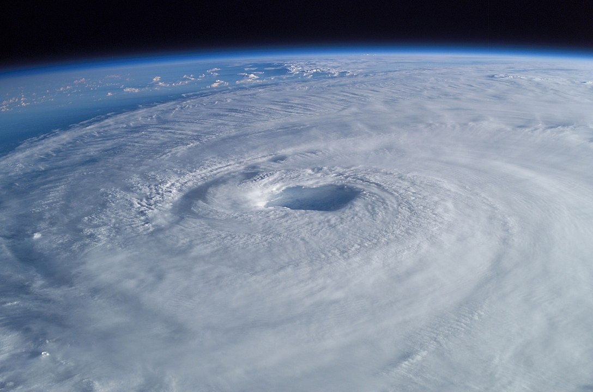
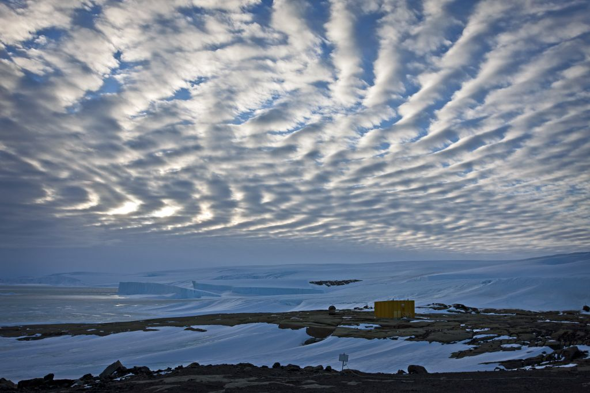
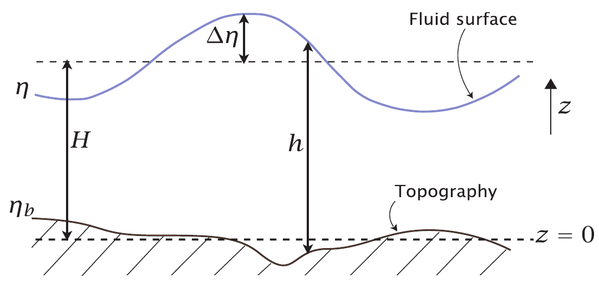

# Part 1: Two dimensional models of geophysical turbulence

## Background

:::::::::::::::: {.columns}
::: {.column width="50%"}

**Atmospheric energy spectrum**^[@NastromGage1985 © AMS]

{width=90% height=70%}
<!-- {width=80% height=60%} -->

:::
::: {.column width="50%"}

. . .

Two inertial ranges, separated by scales:

\ 

- planetary / synoptic scales $E(k) \sim k^{-3}$
  {width=70% height=28%}

. . .

- mesoscales $E(k) \sim k^{-5/3}$
  {width=70% height=28%}

:::
:::::::::::::::::::::::::::::

. . .

\centering{\alert{How do we theorize the mechanism behind these two inertial ranges?}}

### Two-dimensional turbulence

Kraichnan's theory of 2D turbulence[^kraichnan]

- **Vorticity** and **enstrophy** conservation: a strong constraint on cascade

- Dual cascade:
$$E(k) \sim \epsilon^{2/3}k^{-5/3},\quad E(k) \sim \eta^{2/3}k^{-3}$$

. . .

- Directions of cascades:

  - $k^{-5/3}$ range: constant energy flux[^kolmo] $\epsilon$, **inverse** cascade

  - $k^{-3}$ range: constant enstrophy flux $\eta$, **forward** cascade

. . .

- Spatial scales of inertial ranges: "a paradox"[^frisch]
  !["A paradox"[^frisch]](../imgs/cascade_horiz.png){width=70% height=40%}

[^kraichnan]: @Kraichnan1967
[^kolmo]: Similar to @Kolmogorov1941's theory
[^frisch]: @Frisch

### Quasi geostrophic equation

- Quasi-geostrophic equation conserves an approximate *potential vorticity*:
  $$\Dt{q} = 0,$$
  $$ q = \nabla^2 \psi + \frac{\alert<2>{f_0}^2}{\tilde \rho}
  \left(\frac{\tilde \rho}{\alert<3>{N}^2} \p_z \psi \right) + \alert<2>{\beta} y, $$

. . .

- Incorporates [rotation]{alert="<2>"} and [stratification]{alert="<3>"} in a 2D model

- Bridging **ideal 2D turbulence** to **atmospheric turbulence**

- Reproduces $k^{-3}$ spectrum^[@Charney1971]

- <4-> Valid for **strong rotation**, lengths scales **smaller than
  planetary** scales

- <5-> No ageostrophic motion, for example: **inertial gravity waves**

<6-> \centering{{\alert{What about the $k^{-5/3}$ mesoscale spectrum?}}}

### Possible explanations of mesoscale spectrum

#### Hypotheses for cascade directions {.cbox}

- @Gage:1979 & @Lilly:1983: **inverse energy cascade** as in @Kraichnan1967

- @Dewan:1979: **forward energy cascade** as in @Kolmogorov1941

#### {.endblock}

. . .

#### Vertical resolutions {.cbox}

* @Waite-Bartello:2004 and @Lindborg2006 : **stratified turbulence**. $l_v \sim u/N \approx 1 \text{km}$. 
* @Buhler-Callies-Ferrari:2014 : **inertia gravity waves**. Frequency
  $\omega \approx f$. i.e. $l_v \approx$ 100 metres.

#### {.endblock}

. . .

\ 

::::::::::::::::::::::::::::: {.columns}

::: {.column width=40%}

DNS of stratified turbulence supports:
^[@Lindborg2006 ]

* $k^{-5/3}$ spectrum

- **forward cascade**

- **fine vertical resolution** requirement

:::
::: {.column}

. . .

General circulation models^[@Augier-Lindborg:2013] shows:

* $k^{-5/3}$ spectrum

- **forward cascade** in mesoscales

- with **coarse resolution**: 24 pressure levels along vertical

:::
:::::::::::::::::::::::::::::::::::::::::

. . .

\centering{{\alert{Minimum number of vertical levels? Is it possible with a single level model?}}}

## Shallow water equations

### Properties of shallow water equations

#### Governing equations

::: notes

- Inviscid equations conserves in a periodic domain (no boundary fluxes)

:::

::::::::::{.columns}
:::{.column width=50%}

  \begin{align*}
  \partial_t \alert<2>{\mathbf{u}} &= - (\alert<2>{\mathbf{u}}.\nabla) \alert<2>{\mathbf{u}}
      - \alert<3>c^2 \nabla \alert<5>h - \alert<4>f\mathbf{e_z} \times \alert<2>{\mathbf{u}}, \\
  \partial_t \alert<5>h &= - \nabla \cdot (\alert<5>h \alert<2>{\mathbf{u}}).
  \end{align*}

- where,

  + <2-> $\alert<2>{\mathbf{u}}=$ horizontal velocity vector,
  + <3-> $\alert<3>{c} =$ wave speed,
  + <4-> $\alert<4>f$ = Coriolis parameter,
  + <5-> $\alert<5>{h} = H + \eta$, height of fluid^[@vallis_atmospheric_2017].

:::
:::{.column width=50%}

<5-> {width=100% height=40%}
:::
:::::::::::::::::::

\onslide<6->

- with **good properties**:

  + conserves **energy** $E = E_K + E_P$ 
  + conserves **potential vorticity**, $Q = (\zeta + f)/h$
  + equipartition of $E_K$ and $E_P$ over a wave period

\ 
\onslide<7->

- and some **downsides**!

  + waves $\to$ shocks
  + cubic $E_K = h\mathbf{u.u} / 2$

### Theoretical results in Paper 1^[ @augier_shallow_2019 ]

- Analogue of @Kolmogorov1941's $\frac{4}{5}$ law for $3^{rd}$-order structure
  function,
  \begin{equation*}
  \meane{ |\delta \uu|^2 \delta J_L }
  + c^2\meane{ (\delta h)^2 \delta u_L } = -4 \epsilon r,
  \end{equation*}
  where $J_L \equiv h \uu \cdot\rr / |\rr|$ and $u_L \equiv \uu\cdot\rr / |\rr|$

{width=60%
height=40%}

. . .

- Positive flux $\Rightarrow$ **forward energy** cascade

## Toy model equations

## Results

# Part 2: MILESTONE experiment

## Experimental setup

## Software systems

## Preliminary results

# Part 3: Open research software

## Methods and tools for software development

## Python programming language

## FluidDyn project

## Performance

